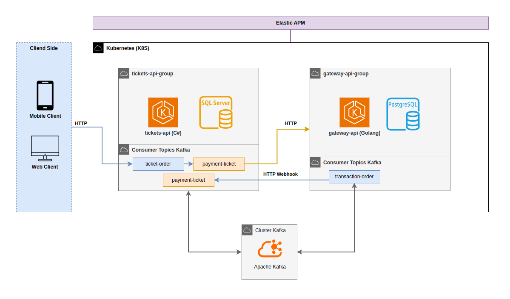

# 🎟️ Tickets Gateway

This repository implements a microservices architecture for an event ticketing and management system. The architecture is composed of services developed in C# (.NET Core) and GoLang, using Apache Kafka for asynchronous communication, Docker and Kubernetes for orchestration, and SQL Server and PostgreSQL databases.

